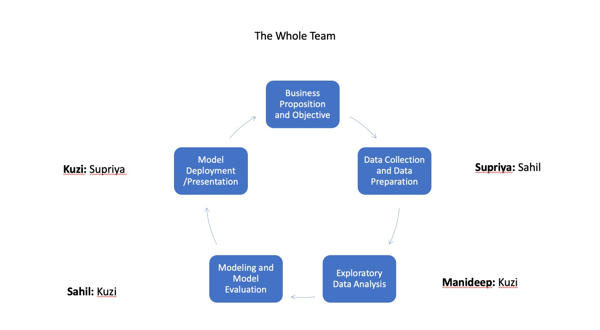

# DS-620-Data_Visualization Final Project

### Contributors

> Supriya Teegala

> Manideep Lenkalapally

> Mohamad Sahil

> Kuzi Rusere

***Business Proposition:*** Providing a Retail Business with a strategy which helps improve their product sales, inventory management, and customer retention, hence improving the profitability of the business.  
***Methodology:*** Data Mining, Analysis and Visualization of Retail Sales Data. This will be done mainly using Market Basket Analysis (MBA), which aims to find relationship and establishing pattens within the retail sales data or purchases. MBA looks for relationships or associations among entities and objects that frequently appear together (for example in a retail sales dataset), such as the collection of items in a shopper’s cart.

***Project Responsibility Allocation***

From the image above, the group members in bold are going to be taking 'point' meaning they are going to be the ones in charge of the particular part of the project. So Supriya is going to be in charge of the data collection and data preparation with the help of Sahil. Manideep (with the assistance of Kuzi) is going to be doing the EDA part of the project, making preliminary data visualization in Tableau and then translating the visualization in python using Plotly. Sahil is going to be doing the Model building and evaluation, with assistance from Kuzi. Kuzi will do the Model Deployment/Presentation.
